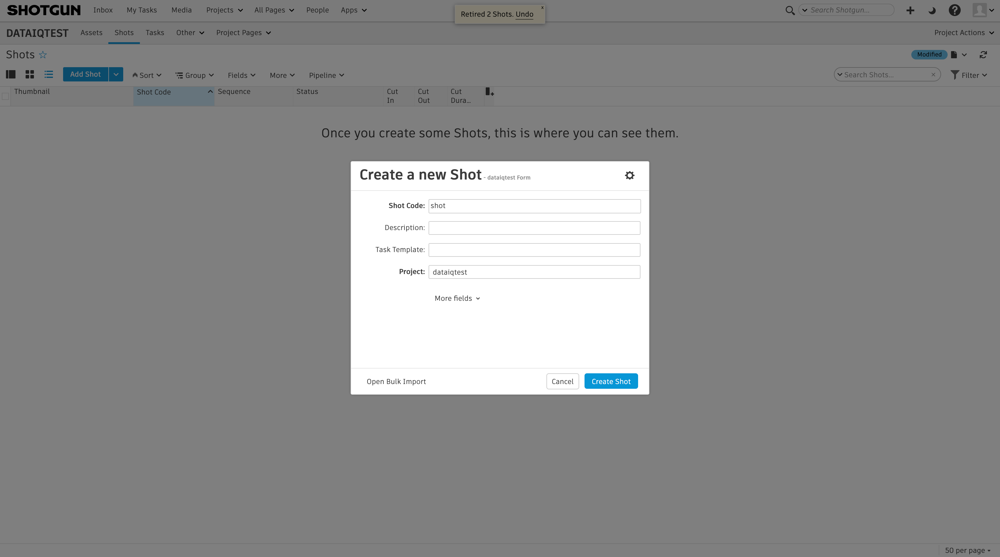

The shotgun plugin connects to the shotgun API and applies tag to the shots found on the filesystem

# Prerequisite

Have DataIQ running on the host machine

## Installation

### Create a temporary folder for building process

```bash
$ mkdir build_tmp
```

### Copy plugin-template-0.1 folder content into previously created temporary folder

```bash
$ cp -r ./plugin-template-0.1/* ./build_tmp/
```

### Copy plugin code in the template sample

```bash
$ cp -r ./cn_shotgun/*.py ./build_tmp/plugin-shotgun/plugin
```

### Copy plugin configuration

```bash
$ cp -r ./build_tmp/plugin-shotgun/plugin/ca.control ./build_tmp/dataiq-shotgun
```

### Change directory

```bash
$ cd ./build_tmp/plugin-shotgun
```

### Rebuild docker image

```bash
$ ./rebuild
```

### Start container in debug mode

```bash
$ ./debug
```

### Get pods name and copy the pod name related to plugin-shotgun

```bash
$ ./listpods
```

e.g:
**plugin-shotgun-5f7fff54c5-s22mt**

```
claritynow-6b8b9568f7-9g47x       1/1     Running     0          60m
claritynow-plugin-init-clhrp      0/1     Completed   0          60m
clew-55cd5dd466-bskss             1/1     Running     0          61m
imanager-667cd998c-kh5l9          1/1     Running     0          60m
ixui-5db7946d5f-2nvkt             1/1     Running     0          61m
keycloak-0                        1/1     Running     0          58m
keycloakdb-0                      1/1     Running     0          61m
plugin-shotgun-5f7fff54c5-s22mt   1/1     Running     0          67s
```

### Connect to container

```bash
$ kubectl exec -it -ndataiq <POD NAME> bash
```

Replace <POD NAME> with the correct value.
e.g:

```
kubectl exec -it -ndataiq plugin-shotgun-5f7fff54c5-s22mt bash
```

### Start plugin server

```bash
$ flask run --host=0.0.0.0 --port=5000
```

## Plugin configuration

### Configure autotagging

Shotgun plugin needs tags to identify shotgun shots. This is done using the autotagging feature.

In DataIQ go to **settings** > **data management configuration** > **Other settings** > **Autotagging configuration file**

<div style="text-align:center">


</div>

Add at the end of file the following:
Replace the <VOLUME NAME> with your volume name

```
match /<VOLUME NAME>/([^/]+)/sequences/([^/]+)/shots/([^/]+)
   max_depth 6
   apply_tag shot/$1_$2_$3
```

<div style="text-align:center">

</div>

### Configure Shotgun plugin

In DataIQ go to **settings** > **data management configuration** > **plugins** > **Select Shotgun plugin** > **Edit configuration**

<div style="text-align:center">

</div>

and edit the global configuration:

```yml
"Global Configurations":
  shotgunAPIUrl: "YourShotgunAPIUrl"
  shotgunAPIScriptName: "YourShotgunAPIScriptName"
  shotgunAPIKey: "YourShotgunAPIKey"
  expirationDelay: 7
```

<div style="text-align:center">

</div>

### Enable Shotgun plugin

Once configured you can enable the plugin by going to:
**settings** > **data management configuration** > **plugins** > **Select Shotgun plugin** > **Enable**

<div style="text-align:center">

</div>

The plugin is automatically executed everyday at 1:00 AM (You can also edit the Cron jobs in the configuration file)

**settings** > **data management configuration** > **plugins** > **Select Shotgun plugin** > **Edit configuration**

<div style="text-align:center">

</div>

### Trigger Shotgun plugin manually

You can trigger the plugin manually by selecting a folder on DataIQ dashboard

<div style="text-align:center">

</div>

Select the "Actions" tab and click **Run shotgun plugin**

<div style="text-align:center">

</div>

## Configure Shotgun

### Register on Shotgun

Create an account on https://www.shotgunsoftware.com/ and signin

You have access to a free 30 days trial

### Create a new project

<div style="text-align:center">

</div>

### Create a new sequence

<div style="text-align:center">

</div>

<div style="text-align:center">

</div>

### Add a a new shot

<div style="text-align:center">

</div>

<div style="text-align:center">

</div>

### Attach the shot to the create sequence

<div style="text-align:center">

</div>

<div style="text-align:center">

</div>

### Create a new API

Go to Scripts

<div style="text-align:center">

</div>

<div style="text-align:center">

</div>

Once created [edit the global configuration with the API credentials](#configure-shotgun-plugin)

### Create the folder hierarchy

On the host machine go to your mounted volume and create the following folders:

```bash
$ mkdir -p dataiqtest/sequences/sequence/shots/shot
```

If you look carefully, our hierarchy is composed of the following:

```
<PROJECT_NAME>/SEQUENCES/<SEQUENCE_FOLDERS>/SHOTS/<SHOT_FOLDERS>

.
`-- sequences
    `-- sequence
        `-- shots
            `-- shot
```

- The sequences folder is composed of folders within the same name of the sequences created on Shotgun
- The shots folder is composed of folders within the same name of the shots created on Shotgun

For instance if we have a shot named 'test' we will have the following tree:

```
.
`-- sequences
    `-- sequence
        `-- shots
            `-- shot
            `-- test
```

### Run Shotgun plugin

Now you can re-scan volumes and [trigger Shotgun manually](#trigger-shotgun-plugin-manually)

If everything worked correctly you will have your shots tagged!

<div style="text-align:center">

</div>
